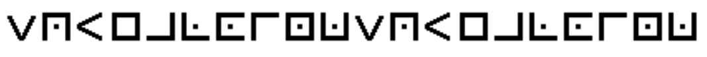

# Cryptography questions

## Challenge 1 (100 points)
**Challenge:**  
Decrypt the text from the attached document!


**Answer:**  
hey_hello_hi

## Challenge 2 (200 points)
**Challenge:**    
See if you can find out what the below text means!

```

> ++++++++[>++++[>++>+++>+++>+<<<<-]>+>+>->>+[<]<-]>>.>---.+++++++..+++.>>.<-.<.+++.------.--------.>>+.>++.
```
**Answer:**  
Hello World!

## Challenge 3 (300 points)
**Challenge:**  
See if you can decode the secret message in the file!


<!--  -->

**Answer:**  
dotdashditdah

## Challenge 4 (400 points)
**Challenge:**  
See if you can decrypt the hidden message in the attached file!


**Answer:**  
squealoinksquealoink

## Challenge 5 (500 points)
**Challenge:**  
Given the string below, see if you can find the flag using the attached file:

```

ÖÊËÕËÕÏÛÈÃØÈÑÐÖ
```


**Answer:**  
THISISMYFAVFONT
